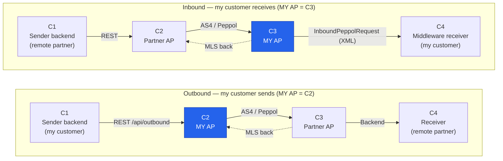
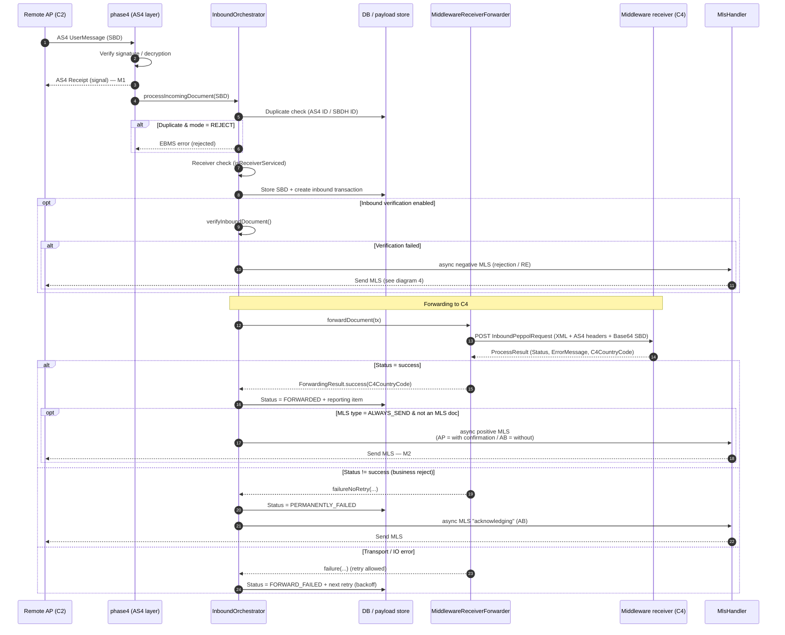
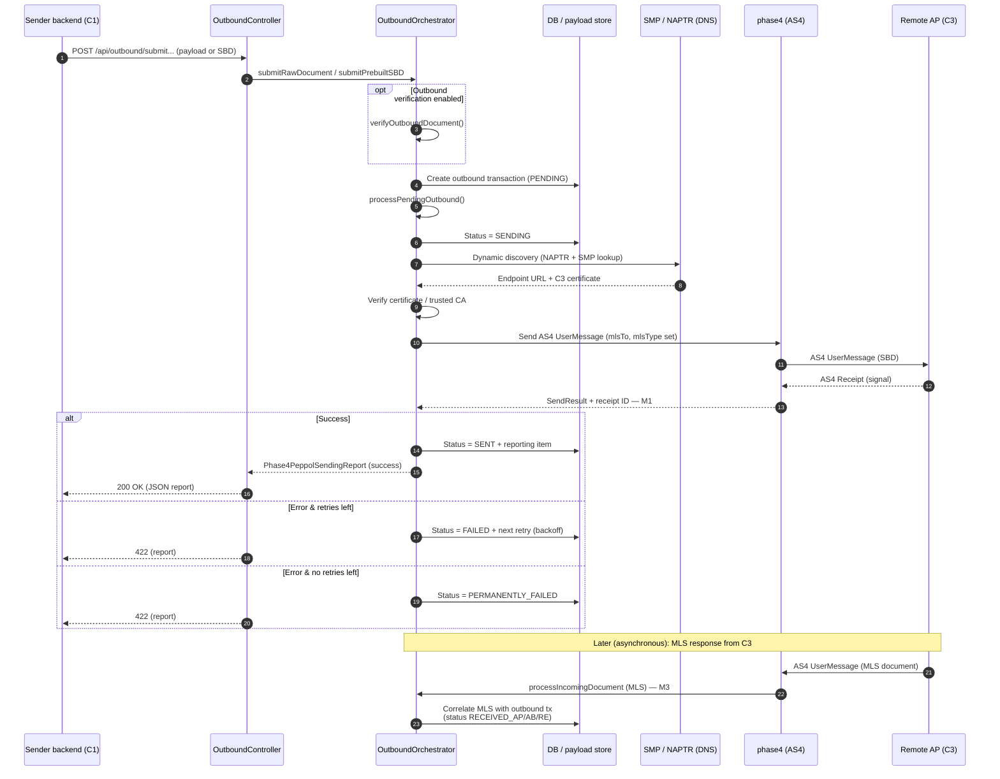
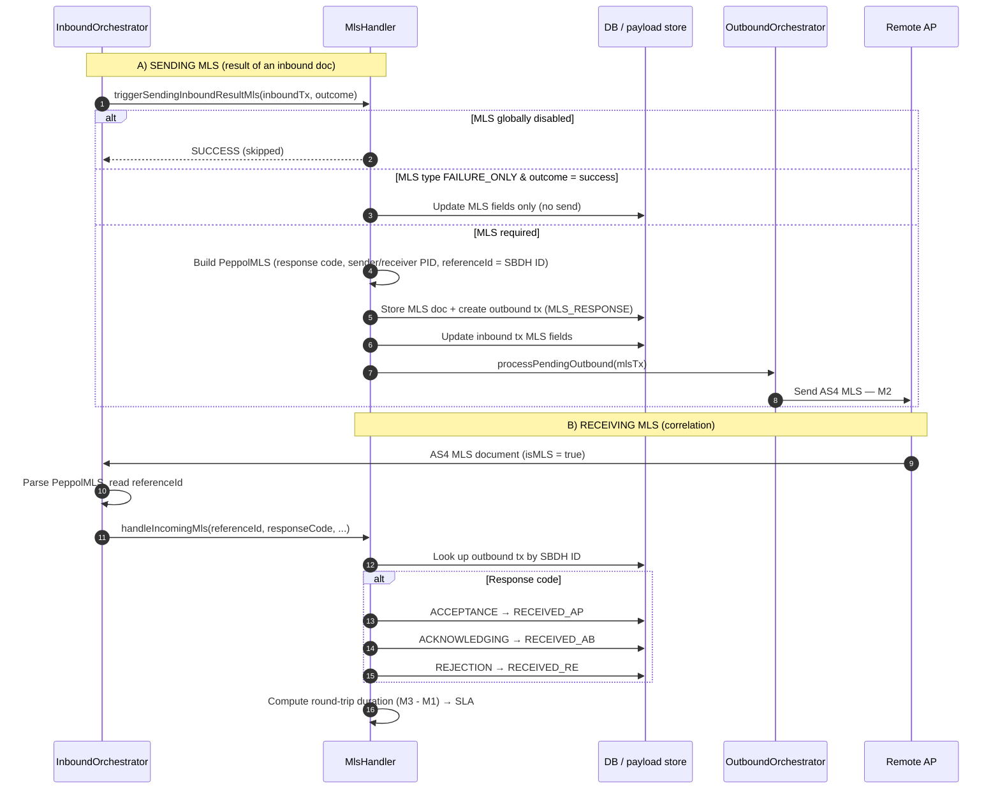

# Access Point communication flows (incl. MLS)

This document describes the communication with this Peppol Access Point and the message flow
including **MLS** (Message Level Status). The diagrams reflect the actual code:

- [`InboundOrchestrator.java`](../phoss-ap-core/src/main/java/com/helger/phoss/ap/core/inbound/InboundOrchestrator.java)
- [`OutboundOrchestrator.java`](../phoss-ap-core/src/main/java/com/helger/phoss/ap/core/outbound/OutboundOrchestrator.java)
- [`MlsHandler.java`](../phoss-ap-core/src/main/java/com/helger/phoss/ap/core/mls/MlsHandler.java)
- [`MiddlewareReceiverForwarder.java`](../phoss-ap-webapp/src/main/java/com/helger/phoss/ap/webapp/middleware/MiddlewareReceiverForwarder.java)
- [`OutboundController.java`](../phoss-ap-webapp/src/main/java/com/helger/phoss/ap/webapp/controller/OutboundController.java)
- [`MlsController.java`](../phoss-ap-webapp/src/main/java/com/helger/phoss/ap/webapp/controller/MlsController.java)

> Fork-specific behaviour is documented in [`CUSTOMIZATIONS.md`](CUSTOMIZATIONS.md).

## 1. Peppol 4-corner model

In the Peppol 4-corner model the corner numbers are assigned **per message direction**, not
fixed to a physical party: **C1** is always the *sender* (originator) of a document, **C2** its
sending Access Point, **C3** the receiving Access Point and **C4** the *receiver*. The same
physical Access Point therefore plays **different corners depending on direction**:

- When **sending** (my customer is the originator), my AP is **C2**.
- When **receiving** (my customer is the recipient), my AP is **C3**.

So "my customer" is **C1** on the outbound path but **C4** on the inbound path; the remote party's
AP is **C3** outbound but **C2** inbound.

## 2. Inbound: receiving a business document (this AP = C3) incl. MLS

M1 = reception of the AS4 message, M2 = successfully sending the MLS back to C2.

## 3. Outbound: sending a business document (this AP = C2) incl. later MLS

M1 = successful send, M3 = reception of the MLS from C3.

## 4. MLS creation & correlation (detail)

## SLA measurement points

From [`MlsController.java`](../phoss-ap-webapp/src/main/java/com/helger/phoss/ap/webapp/controller/MlsController.java):

| Metric                     | Measurement                                       | Target (Peppol Network Policy) |
|----------------------------|---------------------------------------------------|--------------------------------|
| **MLS-1** (receiving side) | M2 − M1: receiving business doc → MLS sent back   | 99.5 % ≤ 20 min                |
| **MLS-2** (sending side)   | M3 − M1: business doc sent → MLS received from C3 | 99.5 % ≤ 25 min                |

REST endpoints:

- `GET /api/mls/missing` — inbound transactions with no MLS response sent yet
- `GET /api/mls/sla/mls1` — MLS-1 SLA report (receiving side)
- `GET /api/mls/sla/mls2` — MLS-2 SLA report (sending side)

## Fork-specific behaviour (important)

A rejection by the C4 middleware `receiver` does **not** produce an AS4 error back to C2 — at that
point the AS4 receipt has already been sent positively. The rejection is instead signalled via
**MLS + transaction status** (shown as "business reject" in diagram 2). See
[`CUSTOMIZATIONS.md`](CUSTOMIZATIONS.md), section "Behavioural differences", for details.
