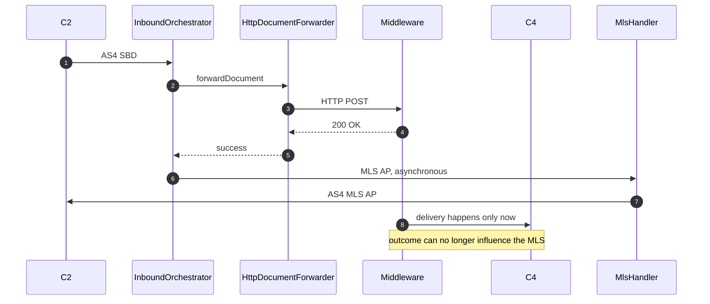
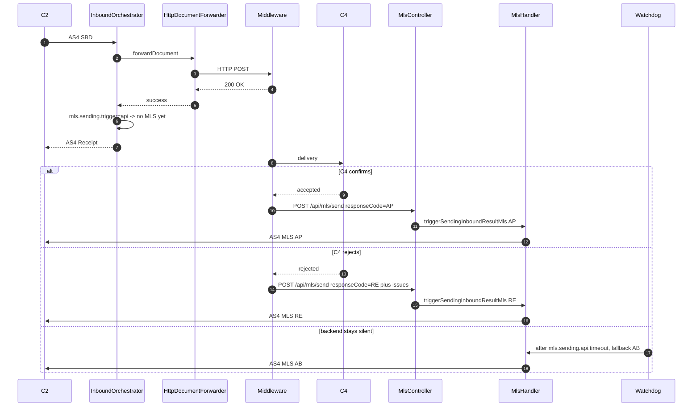

# FR-001: API-triggered MLS sending (deferred MLS for HTTP forwarding)

**Type:** Feature request
**Affected version:** current `main` (0.10.x)
**Affected modules:** `phoss-ap-core`, `phoss-ap-webapp`, `phoss-ap-api`
**Related:** [FR-002](FR-002-mls-after-successful-retry.md), [FR-003](FR-003-mls-configuration-robustness.md)

## Summary

Add an MLS mode in which phoss-ap does **not** send the positive MLS automatically when forwarding
succeeds, but waits for the Receiver Backend to report the outcome through a new REST endpoint.
The backend passes the intended MLS status, and phoss-ap builds, persists and sends the MLS
document exactly as it does today.

Concretely:

1. A new configuration property that switches the *trigger* for the positive MLS from
   "forwarding succeeded" to "API call received".
2. A new endpoint `POST /api/mls/send` that accepts an SBDH Instance ID plus an MLS status
   (`AP`, `AB` or `RE`, optionally with response text and rejection issues).

## Motivation

For an AP in the C3 role, HTTP forwarding usually does not target C4 directly, but a middleware in
front of C4. phoss-ap currently equates "the forwarding HTTP call returned 2xx" with "the document
was delivered", and therefore sends MLS `AP` (`acceptance`) at that moment
(`phoss-ap-core/src/main/java/com/helger/phoss/ap/core/inbound/InboundOrchestrator.java:504-522`,
code selection at line 515, `HttpDocumentForwarder.isWithDeliveryConfirmation()` returns `true`
unconditionally).

In such a deployment the MLS is a statement about a fact that has not happened yet: the middleware
has accepted the document, but delivery to C4 is still pending. C2 and C1 receive a positive
delivery confirmation that the AP cannot actually back up, and a later failure between middleware and
C4 can no longer be reported at all, because MLS for that message is already closed.

The party that *does* know when the document reached C4 is the backend. It should be able to tell
the AP — the AP already offers exactly this pattern for Peppol Reporting via
`POST /api/inbound/report`, which the backend calls after processing. What is missing is the same
handshake for MLS.

## Current behaviour



## Why the existing options do not solve it

| Option | Why it fails |
|---|---|
| Middleware delays the HTTP response until C4 confirms | Forwarding runs **synchronously inside the AS4 request** (`Phase4InboundMessageProcessorSPI` → `InboundOrchestrator.processIncomingDocument` → `forwardDocument` at line 495). While the HTTP response is pending, no AS4 Receipt is returned to C2, so C2's response timeout (phoss-ap's own default is `phase4.send.timeout.response.ms=30000`) expires and the message is retransmitted. Only viable for sub-second/second-range confirmations. |
| `mls.type=FAILURE_ONLY` | Removes the wrong positive MLS, but also removes every positive MLS. In addition `MlsHandler.java:116` filters *all* successful response codes, and `AB` counts as successful — so the `AB` that signals "forwarding to C4 failed for now" (`InboundOrchestrator.java:744-759`) is suppressed as well. |
| Custom `IDocumentForwarderProviderSPI` that waits for C4 | Same blocking problem as the first row: the SPI forwarder runs in the same synchronous AS4 request. |
| `mls.sending.enabled=false` plus own MLS sending | There is no API to trigger MLS, so this simply disables MLS entirely. |

## Proposed solution

### 1. New configuration property

```properties
# When does phoss-ap send the *positive* MLS for a successfully forwarded document?
#   auto = immediately after successful forwarding (current behaviour, default)
#   api  = only when the Receiver Backend calls POST /api/mls/send
#mls.sending.trigger=auto
```

Suggested constants in `APConfigurationProperties`:

```java
public static final String MLS_SENDING_TRIGGER = "mls.sending.trigger";
public static final String MLS_SENDING_TRIGGER_DEFAULT = "auto";
```

Rationale for a separate property instead of a new `mls.type` value: `mls.type` maps 1:1 onto the
Peppol enum `EPeppolMLSType` (`ALWAYS_SEND` / `FAILURE_ONLY`) and should keep doing so. The trigger
is an implementation concern of this AP, not a Peppol concept.

`mls.sending.trigger=api` only defers the **positive** MLS of the success path
(`InboundOrchestrator.java:504-522`). Everything else stays automatic:

* `RE` after failed inbound verification (`InboundOrchestrator.java:409-423`) — the document never
  reached the backend, so the backend cannot report anything.
* `AB` after exhausted forwarding retries (`InboundOrchestrator.java:744-759`) — same reasoning.

### 2. Safety net: fallback after a timeout

MLS-1 of the Peppol Network Policy requires 99.5 % of MLS responses within 20 minutes
(`MlsMetricsManagerJdbc.SLA_MLS1_THRESHOLD`). A silent backend must not put the AP out of
compliance, so `api` mode needs a watchdog:

```properties
# In trigger mode "api": if the backend has not reported a status within this duration
# after successful forwarding, phoss-ap sends a fallback MLS on its own.
# Duration values use suffixes: ns, us, ms, s, m, h, d
#mls.sending.api.timeout=15m
# Response code used for the fallback: AB (acknowledging) or AP (acceptance)
#mls.sending.api.timeout.code=AB
```

`AB` is the semantically correct default: the document was accepted, delivery is not confirmed.
The watchdog fits naturally into the existing `RetryScheduler` cycle (or a small sibling job) by
selecting inbound transactions with `status = forwarded`, `mls_response_code IS NULL` and
`completed_dt < now - timeout`.

### 3. New endpoint `POST /api/mls/send`

Placed in the existing `MlsController` (`/api/mls`), secured by the existing API token filter.

Request body (`MlsSendRequest` in `phoss-ap-api/.../dto/`):

```json
{
  "sbdhInstanceID": "550e8400-e29b-41d4-a716-446655440000",
  "responseCode": "AP",
  "responseText": "Delivered to C4 backend, order 4711",
  "issues": []
}
```

Rejection example:

```json
{
  "sbdhInstanceID": "550e8400-e29b-41d4-a716-446655440000",
  "responseCode": "RE",
  "responseText": "C4 rejected the invoice",
  "issues": [
    {
      "statusReasonCode": "BV",
      "errorField": "cac:AccountingCustomerParty",
      "description": "Unknown customer number 12345"
    }
  ]
}
```

Field semantics:

| Field | Required | Maps to |
|---|---|---|
| `sbdhInstanceID` | yes | lookup via `IInboundTransactionManager.getBySbdhInstanceID` |
| `responseCode` | yes | `EPeppolMLSResponseCode`: `AP`, `AB`, `RE` |
| `responseText` | no | `MlsOutcome.getResponseText()` |
| `issues[].statusReasonCode` | for `RE` | `EPeppolMLSStatusReasonCode`: `BV`, `BW`, `FD`, `SV` |
| `issues[].errorField` | for `RE` | `MlsOutcomeIssue.getErrorField()` |
| `issues[].description` | for `RE` | `MlsOutcomeIssue.getDescription()` |

Server side this maps onto the existing model without new domain logic:

```java
final MlsOutcome aOutcome = switch (eResponseCode)
{
  case ACCEPTANCE    -> MlsOutcome.acceptance ();
  case ACKNOWLEDGING -> MlsOutcome.acknowledging (sResponseText);
  case REJECTION     -> MlsOutcome.rejection (sResponseText, aIssues);
};
MlsHandler.triggerSendingInboundResultMls (aInboundTx, aOutcome);
```

Response (reuse `ReportResponse` or a small `MlsSendResponse` carrying the created outbound
transaction ID):

| HTTP | Condition |
|---|---|
| 200 | MLS created and handed to the outbound sender; body contains inbound transaction ID and MLS outbound transaction ID |
| 400 | unknown `responseCode`, `RE` without issues, invalid `statusReasonCode` |
| 401 | missing/invalid API token |
| 404 | no inbound transaction for the given SBDH Instance ID |
| 409 | an MLS was already determined for this transaction (`mls_response_code` is set) — unless `force=true` is passed |
| 422 | the transaction is not eligible, e.g. it is itself an MLS/MLR document (`CPhossAP.isMLS` / `isMLR`) |
| 503 | `mls.sending.enabled=false` |

Behavioural guards:

* Idempotency: a second call for the same transaction returns 409 instead of sending a second MLS.
  Peppol expects exactly one MLS per business document.
* Existing filters keep applying: the global kill switch `mls.sending.enabled`
  (`MlsHandler.java:93`) and the `FAILURE_ONLY` filter (`MlsHandler.java:116`). Note that in
  `FAILURE_ONLY` an `AP`/`AB` submitted through the API is recorded but not sent — that is
  consistent with today's semantics and should be documented in the OpenAPI description.
* Never allow MLS for inbound MLS/MLR documents.
* Sending stays asynchronous/robust: the endpoint should return as soon as the outbound MLS
  transaction is persisted; the actual AS4 send and its retries are already handled by
  `OutboundOrchestrator` plus `RetryScheduler`.
* Works independently of the inbound status, so a backend can also report `RE` for a document that
  it received but cannot process — which is a second, independent gain of this feature.

### Target flow



### Interaction matrix

| `mls.sending.trigger` | `mls.type` | successful forwarding | API call | Result |
|---|---|---|---|---|
| `auto` | `ALWAYS_SEND` | yes | – | `AP`/`AB` immediately (today's behaviour) |
| `auto` | `FAILURE_ONLY` | yes | – | no MLS |
| `api` | `ALWAYS_SEND` | yes | `AP` | `AP` when the backend reports |
| `api` | `ALWAYS_SEND` | yes | none within timeout | fallback `AB` |
| `api` | `ALWAYS_SEND` | yes | `RE` + issues | `RE` with issues |
| `api` | `FAILURE_ONLY` | yes | `AP`/`AB` | recorded only, not sent |
| `api` | `FAILURE_ONLY` | yes | `RE` + issues | `RE` sent |
| `api` | any | permanently failed | – | automatic `AB` as today |

## Acceptance criteria

* [ ] `mls.sending.trigger=auto` reproduces today's behaviour bit for bit (default value, no
      migration needed).
* [ ] With `mls.sending.trigger=api`, a successfully forwarded business document produces **no**
      MLS until either the API is called or the watchdog timeout expires.
* [ ] `POST /api/mls/send` creates the MLS outbound transaction, updates `mls_response_code` and
      `mls_outbound_transaction_id` on the inbound transaction, and sends via the normal outbound
      path including retry.
* [ ] `AP`, `AB` and `RE` (with 1..n issues) are all supported; `RE` without issues is rejected
      with 400.
* [ ] Second call for the same SBDH Instance ID yields 409 and sends nothing.
* [ ] MLS/MLR inbound documents cannot be answered through the endpoint.
* [ ] The endpoint is covered by the existing API token security scheme and documented in the
      OpenAPI output.
* [ ] `GET /api/mls/missing` lists transactions that are waiting for an API-triggered MLS, so the
      backlog is observable.
* [ ] The MLS-1 SLA report keeps working: `M2` is the timestamp of the API-triggered send.
* [ ] Unit/integration tests: `auto` vs `api` mode, all three response codes, idempotency conflict,
      watchdog fallback, kill switch, `FAILURE_ONLY` interaction.

## Backwards compatibility

Fully backwards compatible. The new property defaults to `auto`, the new endpoint is additive, and
no database schema change is strictly required — the watchdog can work off the existing columns
(`status`, `completed_dt`, `mls_response_code`). An explicit `mls_pending_since` column would be
nicer but is optional.

## Alternatives considered

* **Extend `POST /api/inbound/report`** with an optional MLS status instead of adding a new
  endpoint. Fewer calls for the backend (country code and MLS status in one request), but it mixes
  Peppol Reporting and MLS concerns and the endpoint currently rejects a second call once the
  country code is set.
* **Sending the MLS from the retry path** (see [FR-002](FR-002-mls-after-successful-retry.md)) —
  useful in its own right, but it does not help here, because the middleware acknowledges the first
  attempt.
* **Making `isWithDeliveryConfirmation()` configurable per forwarder** so that HTTP yields `AB`
  instead of `AP`. Cheap to implement and semantically more honest for middleware setups, but it
  still never reports the real C4 outcome.

## Affected code

| Purpose | Location |
|---|---|
| skip the automatic positive MLS | `phoss-ap-core/src/main/java/com/helger/phoss/ap/core/inbound/InboundOrchestrator.java:504-522` |
| unchanged MLS creation and sending | `phoss-ap-core/src/main/java/com/helger/phoss/ap/core/mls/MlsHandler.java:89-271` |
| new configuration accessors | `phoss-ap-core/src/main/java/com/helger/phoss/ap/core/APCoreConfig.java:664-683`, `phoss-ap-api/src/main/java/com/helger/phoss/ap/api/config/APConfigurationProperties.java:304-307` |
| new endpoint | `phoss-ap-webapp/src/main/java/com/helger/phoss/ap/webapp/controller/MlsController.java` |
| new request/response DTOs | `phoss-ap-api/src/main/java/com/helger/phoss/ap/api/dto/` |
| watchdog job | `phoss-ap-core/src/main/java/com/helger/phoss/ap/core/job/RetryScheduler.java` or a new job class |
