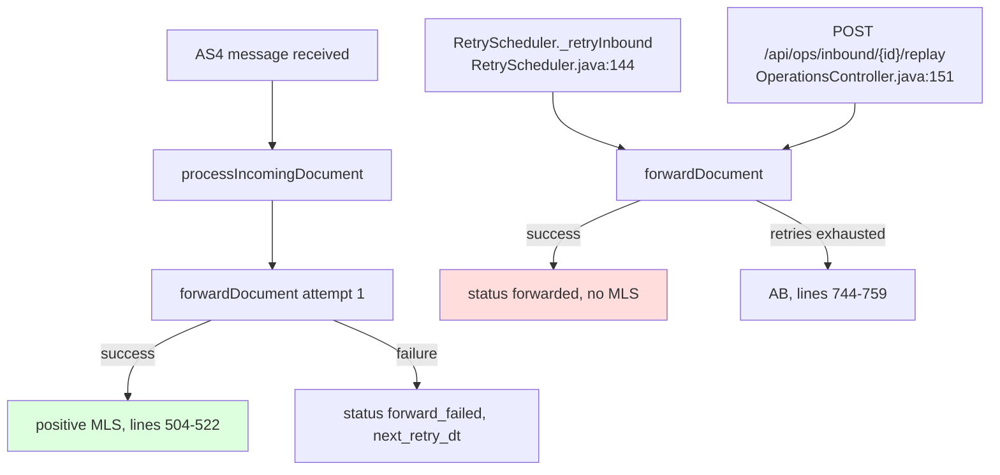

# FR-002: Send the positive MLS when a retried or replayed forwarding finally succeeds

**Type:** Feature request / bug-ish gap
**Affected version:** current `main` (0.10.x)
**Affected modules:** `phoss-ap-core`, `phoss-ap-webapp`
**Related:** [FR-001](FR-001-api-triggered-mls-sending.md)

## Summary

The positive MLS is only triggered inside `InboundOrchestrator.processIncomingDocument`. If the
first forwarding attempt fails and a later retry (or an operator-initiated replay) succeeds, no MLS
is ever sent — even with `mls.type=ALWAYS_SEND`.

## Current behaviour

The MLS-relevant block lives in the calling method, not in `forwardDocument`, so both asynchronous
entry points skip it silently.

## Impact

* A message that is delivered on the second attempt gets no MLS at all, although the sender
  requested one. It stays in `GET /api/mls/missing` forever.
* If the retries were exhausted first, C2 received `AB` ("Forwarding to C4 failed for now") and is
  never told that the document did arrive after all — there is no follow-up MLS.
* Worst case for MLS-1 statistics: the transaction never gets an `M2` timestamp.

## Proposal

Move the "forwarding succeeded" MLS decision into a single place that all three entry points use —
for example a private helper called at the end of the success branch of
`InboundOrchestrator.forwardDocument`, guarded by:

* `aInboundTx.getMlsResponseCode () == null` — never send a second MLS for the same document,
* not an inbound MLS/MLR document (`CPhossAP.isMLS` / `isMLR`),
* the existing `mls.type` / `mls.sending.enabled` filters in `MlsHandler`.

Because `MlsHandler.triggerSendingInboundResultMls` already updates `mls_response_code` through
`updateMlsFields`, the guard is cheap and makes the operation idempotent.

Interaction with [FR-001](FR-001-api-triggered-mls-sending.md): if `mls.sending.trigger=api` is
implemented, this trigger is skipped in `api` mode as well — the backend reports instead.

## Acceptance criteria

* [ ] With `mls.type=ALWAYS_SEND`, a forwarding that succeeds on attempt *n* > 1 produces exactly
      one positive MLS.
* [ ] A replay via `POST /api/ops/inbound/{sbdhInstanceID}/replay` produces a positive MLS if and
      only if none was determined before.
* [ ] No duplicate MLS for transactions that already have `mls_response_code` set (in particular
      the `AB` from the exhausted-retries path).
* [ ] Inbound MLS/MLR documents still never trigger an MLS.
* [ ] Test covering: fail once, succeed on retry, assert exactly one MLS outbound transaction.

## Affected code

| Purpose | Location |
|---|---|
| MLS trigger currently only here | `phoss-ap-core/src/main/java/com/helger/phoss/ap/core/inbound/InboundOrchestrator.java:504-522` |
| success branch shared by all callers | `phoss-ap-core/src/main/java/com/helger/phoss/ap/core/inbound/InboundOrchestrator.java:604-719` |
| retry entry point | `phoss-ap-core/src/main/java/com/helger/phoss/ap/core/job/RetryScheduler.java:144` |
| replay entry point | `phoss-ap-webapp/src/main/java/com/helger/phoss/ap/webapp/controller/OperationsController.java:151` |
