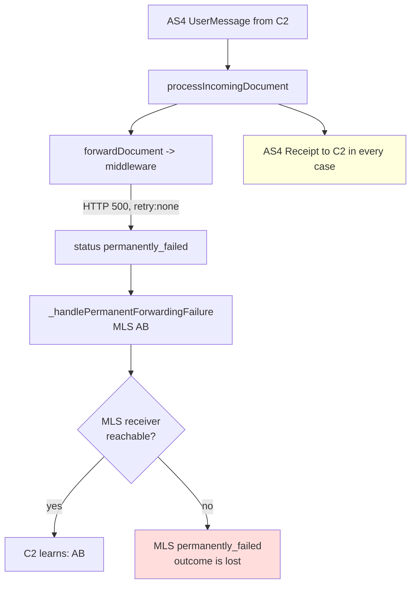

# FR-004: Reject the inbound AS4 message when the forwarding failure cannot be reported via MLS

**Type:** Feature request
**Affected version:** `0.12.1-SNAPSHOT` (branch `feat/trigger-mls`); the behaviour described below is
unchanged since `0.11.0`
**Affected modules:** `phoss-ap-core`, `phoss-ap-api`
**Related:** [FR-001](FR-001-api-triggered-mls-sending.md), [FR-002](FR-002-mls-after-successful-retry.md)

## Summary

Add an opt-in mode in which a **permanent** forwarding failure is reported back to C2 as an AS4/EBMS
error instead of an AS4 Receipt — but only when the MLS that would otherwise carry that failure
**cannot be delivered**, because the MLS receiver is not reachable in the Peppol Network.

Today C2 always receives a Receipt, and the negative outcome travels exclusively via MLS. If the MLS
is undeliverable, the outcome is lost: C2 and C1 believe the document was delivered, and the AP has
no second channel to tell them otherwise.

## Motivation

During the transition to MLS, a large share of receiving APs are registered in the SML but have no
MLS document type in their SMP. For those partners the MLS that reports a rejection fails
immediately and permanently — and nobody learns about it.

Observed on the Lobster dev AP on 2026-09-24 with `mls.sending.trigger=api`
(`forwarding.mode=http_post_sync`, `retry.forwarding.max-attempts=0`):

| MLS outbound transaction | Status | `error_details` |
|---|---|---|
| `04a86ec2` | `failed`, retried with growing backoff | `The participant ID 'iso6523-actorid-upis::0242:000765' is not registered in the Peppol Network … Participant DNS name … is not registered [HOST_NOT_FOUND]` |
| `c1765f72` | `permanently_failed`, no retry | `Error in AS4 sending with result code AS4_ERROR_MESSAGE_RECEIVED` |
| `d61c0ebb` | `permanently_failed`, no retry | `Error in AS4 sending with result code AS4_ERROR_MESSAGE_RECEIVED` |

The two `permanently_failed` cases are the realistic transition-period shape: the participant
resolves via DNS, the MLS goes out over AS4, and the receiving AP answers with an EBMS error because
its receiver check does not find
`ApplicationResponse-2::ApplicationResponse##urn:peppol:edec:mls:1.0::2.1` in the SMP. There is no
retry for that state and no further channel — C2 had already been given a Receipt.

In the same test the middleware rejected a document with HTTP 500 and
`{"retry":"none","errorMessage":"…"}`, which maps to `isRetryAllowed() == false` and therefore to an
immediate `PERMANENTLY_FAILED`
(`InboundOrchestrator.java:1466`). C2 still received a Receipt.

## Current behaviour

Only a non-empty processing error list becomes an EBMS error:

```java
// Phase4InboundMessageProcessorSPI.java:108-123
final ICommonsList <String> aProcessingErrors = InboundOrchestrator.processIncomingDocument (…);
for (final String sErrorDetail : aProcessingErrors)
  aProcessingErrorMessages.add (AS4Error.builder ()
                                        .ebmsError (EEbmsError.EBMS_OTHER.errorBuilder (aDisplayLocale) …));
```

The forwarding failure branch does not add one:

```java
// InboundOrchestrator.java:1283-1295
if (forwardDocument (sLogPrefix, aVerifiedTx).isFailure ())
{
  // Forwarding failed
  for (final var aHandler : APCoreMetaManager.getAllNotificationHandlers ())
    aHandler.onInboundForwardingError (sTxID, false);
}
```

AS4/EBMS errors are produced only for duplicate detection
(`InboundOrchestrator.java:1114-1161`), the receiver check (`PEPPOL:NOT_SERVICED`) and an
unparseable inbound MLS. Everything downstream of "the document is ours and is stored" is reported
via MLS only.

This is **not** a regression of the MLS work: the same policy is present in
`phoss-ap-parent-pom-0.11.0` (`InboundOrchestrator.java:425`, comment `// No processing error - MLS`)
and in `forwardDocument`, which catches the forwarder exception and returns `ESuccess.FAILURE` in
both versions.



## Proposed solution

### 1. New configuration property

```properties
# When a *permanent* forwarding failure occurs in the synchronous receive path, should C2 be
# answered with an AS4/EBMS error instead of a Receipt?
#   never             = always answer with a Receipt and report via MLS only (current behaviour, default)
#   mls-undeliverable = only if the MLS for this transaction cannot be delivered
#   always            = on every permanent forwarding failure
#inbound.forwarding.failure.as4-reject=never
# Budget for the MLS deliverability probe. It runs inside the synchronous AS4 request, so it must
# be short. On timeout the probe is inconclusive and the value below decides.
#inbound.forwarding.failure.mls-probe.timeout=2s
# What an inconclusive probe means: reject (assume MLS is undeliverable) or accept (assume it works)
#inbound.forwarding.failure.mls-probe.inconclusive=accept
```

Suggested enum in `phoss-ap-api`, in the style of `EMlsSendingTrigger` and
`EVerificationRejectionForwarding`:

```java
public enum EInboundForwardingFailureAS4Reject implements IHasID <String>
{
  NEVER ("never"),
  MLS_UNDELIVERABLE ("mls-undeliverable"),
  ALWAYS ("always");

  public static final EInboundForwardingFailureAS4Reject DEFAULT = NEVER;
}
```

### 2. MLS deliverability probe

The MLS receiver is already known at that point: it is the custom `MLS_TO` if the SBDH carried a
valid one, otherwise the default SPID derived from the C2 Seat ID (MLS SPOG 5.4, see
`MlsHandler._createInboundResultMls`). "Deliverable" means an SMP lookup for that participant with

* document type `EPredefinedDocumentTypeIdentifier.PEPPOL_MLS_1_0`
* process `EPredefinedProcessIdentifier.urn_peppol_edec_mls`

yields an endpoint. The lookup must reuse the shared SMP client cache that
`OutboundOrchestrator._performSmpLookup` already uses, so that repeated receives from the same C2 do
not each pay a network round trip. `_performSmpLookup` is private today and would need to be
extracted into a small helper usable from the inbound path.

Note that a positive probe is not a delivery guarantee: `c1765f72` and `d61c0ebb` above show that a
participant can resolve and still answer the MLS with an EBMS error. The probe reduces the blind
spot, it does not remove it.

### 3. Hook point

In `InboundOrchestrator.processIncomingDocument`, in the failure branch at line 1283, and **only**
when the failure is permanent — i.e. the same condition that
`forwardDocument` uses at line 1466 (`!aResult.isRetryAllowed () || nNewAttemptCount >= nMaxRetryAttempts`).
A transient failure that is still scheduled for retry must keep today's behaviour, otherwise C2 is
told "rejected" about a document that may well be delivered a minute later.

`forwardDocument` currently only returns `ESuccess`, so the caller cannot distinguish "failed, will
retry" from "failed permanently". It needs a richer return value — a small result record, or the
caller re-reads the transaction and checks for `EInboundStatus.PERMANENTLY_FAILED`.

## Problems that must be solved for this to work

These are the reasons the feature is not a two-line change.

### a) Duplicate detection turns the rejection into a permanent loop

This is the blocking issue. The inbound transaction is created at
`InboundOrchestrator.java:1221`, *before* forwarding, and duplicate detection by SBDH Instance
Identifier runs at line 1140 with `EDuplicateDetectionMode.REJECT` as the default. If C2 reacts to
the EBMS error by retransmitting the same business document — which is the normal AS4 reaction and
the whole point of returning an error — the retransmission hits

```
Rejecting duplicate SBDH instance '<id>'
```

and is answered with an EBMS error again, forever. The document can then never be delivered, not
even once the middleware recovers.

Any implementation must therefore also define how the transaction is left behind. Options:

1. A new `EInboundStatus` value (e.g. `REJECTED_AS4`) that both duplicate checks ignore, so a
   retransmission is processed as if it were the first delivery. Cleanest, needs a DB migration and
   a careful look at the reporting queries.
2. Delete the transaction and its stored payload before returning the error. Simple, but destroys
   the audit trail of the rejection — unattractive for a Peppol AP.
3. Document that `duplicate.detection.sbdh.mode=allow` is required in this mode. Cheap, but weakens
   duplicate protection for all traffic, not just this case.

Option 1 is the recommended one.

### b) Latency inside the synchronous AS4 request

The probe runs while C2 waits for the AS4 response, on top of the forwarding call that has already
run. phoss-ap's own default response timeout for sending is
`phase4.send.timeout.response.ms=30000`, and C2's timeout is unknown to us. Hence the short,
explicit probe budget and the `inconclusive` setting instead of an unbounded SMP call.

### c) Peppol conformance

The Peppol AS4 profile expects C3 to accept a message that is transport-valid and addressed to a
serviced receiver; failures further downstream belong in MLS. Answering with `EBMS_OTHER` because a
*backend* is unavailable is a deliberate deviation. That is why the feature must be opt-in, default
`never`, and documented as such — including the fact that it makes C2 retransmit.

### d) The middleware must distinguish permanent from transient

The mode only behaves sensibly if the backend's answer is truthful about retryability. phoss-ap
already has the contract for this (`{"retry":"none"}` versus a retryable 5xx, evaluated via
`ForwardingResult.isRetryAllowed()`). This should be called out in the documentation of the new
property: a middleware that reports every hiccup as `retry:none` would turn transient outages into
AS4 rejections.

### e) Only the first, synchronous attempt can ever be rejected via AS4

With `retry.forwarding.max-attempts > 0`, the permanent failure is reached in the `RetryScheduler`,
long after the AS4 response was sent. There is no way back to C2 at that point — the MLS remains the
only channel. The mode is therefore effective only for deployments where the first attempt already
decides, such as `retry.forwarding.max-attempts=0` or a backend answering `retry:none`. This limit
must be stated in the property documentation so the setting is not mistaken for a general safety
net.

## Interaction matrix

| `as4-reject` | Forwarding outcome | MLS deliverable | AS4 answer to C2 | MLS |
|---|---|---|---|---|
| `never` | permanent failure | yes | Receipt | `AB` (today) |
| `never` | permanent failure | no | Receipt | created, `permanently_failed` — outcome lost |
| `mls-undeliverable` | permanent failure | yes | Receipt | `AB` |
| `mls-undeliverable` | permanent failure | no | **EBMS error** | none |
| `mls-undeliverable` | transient failure, retry pending | any | Receipt | later `AB` if retries are exhausted |
| `always` | permanent failure | any | **EBMS error** | none |
| any | forwarding success | any | Receipt | per `mls.type` / `mls.sending.trigger` |

## Acceptance criteria

* [ ] Default `never` reproduces today's behaviour bit for bit.
* [ ] In `mls-undeliverable`, a permanent forwarding failure with an unreachable MLS receiver yields
      an EBMS error to C2 and **no** MLS outbound transaction.
* [ ] In `mls-undeliverable`, a permanent forwarding failure with a reachable MLS receiver yields a
      Receipt and the `AB` MLS, exactly as today.
* [ ] A transient forwarding failure never produces an EBMS error, in any mode.
* [ ] After an AS4 rejection, a retransmission of the same SBDH Instance Identifier is accepted and
      processed, not rejected as a duplicate.
* [ ] The probe respects its timeout and falls back to
      `inbound.forwarding.failure.mls-probe.inconclusive`.
* [ ] The probe result is logged and exposed on the transaction, so an operator can tell why C2 was
      rejected.
* [ ] Tests: all three modes, permanent versus transient failure, reachable versus unreachable MLS
      receiver, probe timeout, retransmission after rejection.

## Alternatives considered

* **Always reject via AS4 on a permanent forwarding failure** (no probe). Much simpler and needs no
  SMP call in the receive path, but it removes the MLS for partners that handle MLS perfectly well,
  and it still has the duplicate-detection problem. Available as the `always` value for operators
  who want it.
* **Leave the code alone and monitor instead.** MLS transactions of type `mls_response` in
  `permanently_failed` are the exact signal; an operator can chase the sender out of band. No code
  change, but the sender still learns nothing automatically. Worth doing regardless of this FR — see
  the logging gap below.
* **Make the forwarding call synchronous end-to-end so the middleware can answer inside the AS4
  window.** Discussed and rejected in [FR-001](FR-001-api-triggered-mls-sending.md): the AS4 request
  would block until C4 confirms, and C2's response timeout expires first.

## Related gaps found while analysing this

Not part of this request, but they surfaced from the same test run and are cheap to fix:

1. **The MLS retry path is silent.** For `04a86ec2`, the log contains
   `[SubmitMLS] […] Processing outbound transaction` and then nothing at all — no BDXL line, no SMP
   query, no error. The reason exists only in the `error_details` column. The `onFailed` branch of
   the SMP lookup in `OutboundOrchestrator` should log a WARN, otherwise an MLS that retries forever
   is invisible in the log.
2. **`MlsHandler` has no idempotency guard.** `triggerSendingInboundResultMls` does not check
   `aInboundTx.getMlsResponseCode () != null`; that check exists only in `MlsController.java:339`.
   If a backend calls `POST /api/mls/send` while the forwarding call is still in flight — observed
   at 10:44:20.463 versus the forwarding response at 10:44:20.580 — and the forwarding then fails,
   `_handlePermanentForwardingFailure` creates a second MLS for the same document. Peppol expects
   exactly one. The guard belongs in `MlsHandler` so that the controller, the watchdog and the
   forwarding failure path all share it. See also FR-002, which proposes the same guard for a
   different reason.

## Affected code

| Purpose | Location |
|---|---|
| translate processing errors into EBMS errors | `phoss-ap-core/src/main/java/com/helger/phoss/ap/core/inbound/Phase4InboundMessageProcessorSPI.java:108-123` |
| forwarding failure branch, new hook point | `phoss-ap-core/src/main/java/com/helger/phoss/ap/core/inbound/InboundOrchestrator.java:1283-1295` |
| permanent versus transient decision | `phoss-ap-core/src/main/java/com/helger/phoss/ap/core/inbound/InboundOrchestrator.java:1466` |
| duplicate detection that must learn about the new status | `phoss-ap-core/src/main/java/com/helger/phoss/ap/core/inbound/InboundOrchestrator.java:1114-1161` |
| automatic `AB` that the new mode replaces | `phoss-ap-core/src/main/java/com/helger/phoss/ap/core/inbound/InboundOrchestrator.java:995` |
| MLS receiver determination to reuse for the probe | `phoss-ap-core/src/main/java/com/helger/phoss/ap/core/mls/MlsHandler.java` (`_createInboundResultMls`) |
| SMP lookup to extract into a reusable helper | `phoss-ap-core/src/main/java/com/helger/phoss/ap/core/outbound/OutboundOrchestrator.java` (`_performSmpLookup`) |
| new configuration accessors | `phoss-ap-core/src/main/java/com/helger/phoss/ap/core/APCoreConfig.java`, `phoss-ap-api/src/main/java/com/helger/phoss/ap/api/config/APConfigurationProperties.java` |
| new enum | `phoss-ap-api/src/main/java/com/helger/phoss/ap/api/codelist/` |
